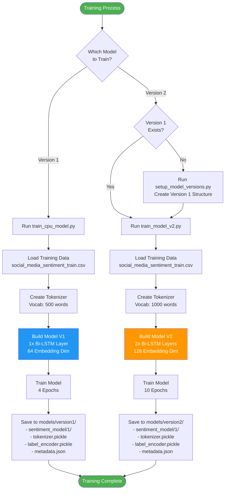
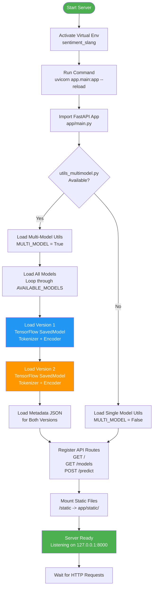
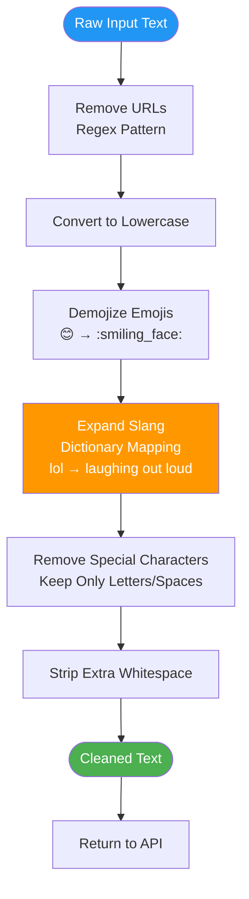
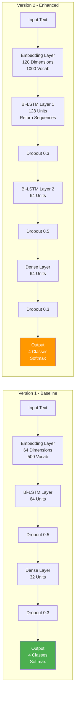

# Sentiment Slang Analyzer - Project Flowchart

## Complete System Flow

```mermaid
flowchart TD
    Start([User Opens Browser]) --> LoadPage[Load Web Interface<br/>localhost:8000]
    
    LoadPage --> CheckModels{Models API<br/>/models}
    CheckModels --> LoadModelsJS[Load Available Models<br/>Version1 & Version2]
    
    LoadModelsJS --> ShowDropdown[Show Model Selector<br/>Default: No Selection]
    ShowDropdown --> DisabledState[Text Input: DISABLED<br/>Analyze Button: DISABLED<br/>Message: Select model first]
    
    DisabledState --> UserSelectModel{User Selects<br/>Model Version?}
    
    UserSelectModel -->|No Selection| DisabledState
    UserSelectModel -->|Version 1 Selected| EnableV1[Enable Text Input<br/>Show: Baseline Model Info]
    UserSelectModel -->|Version 2 Selected| EnableV2[Enable Text Input<br/>Show: Enhanced Model Info]
    
    EnableV1 --> EnterText[User Enters Text]
    EnableV2 --> EnterText
    
    EnterText --> ClickAnalyze{Click<br/>Analyze Button}
    
    ClickAnalyze --> SendAPI[Send POST Request<br/>/predict]
    SendAPI --> APIReceive[FastAPI Receives<br/>text + model_version]
    
    APIReceive --> CleanText[Clean Text<br/>preprocessing.py]
    CleanText --> LoadModel{Load Selected<br/>Model}
    
    LoadModel -->|Version 1| UseV1[Use Version 1<br/>Tokenizer + Model]
    LoadModel -->|Version 2| UseV2[Use Version 2<br/>Tokenizer + Model]
    
    UseV1 --> Tokenize[Tokenize Text]
    UseV2 --> Tokenize
    
    Tokenize --> PadSequence[Pad Sequences<br/>Max Length: 30]
    PadSequence --> Predict[Model Prediction<br/>Bi-LSTM Processing]
    
    Predict --> GetResult[Get Sentiment<br/>+ Confidence]
    GetResult --> ReturnJSON[Return JSON Response<br/>sentiment, confidence,<br/>model_version, model_info]
    
    ReturnJSON --> DisplayResults[Display Results<br/>with Sentiment Icon]
    DisplayResults --> ShowModelUsed[Show Model Used<br/>Version1 or Version2]
    
    ShowModelUsed --> UserDecision{User Action?}
    UserDecision -->|Analyze New Text| EnterText
    UserDecision -->|Change Model| UserSelectModel
    UserDecision -->|Clear| DisabledState
    UserDecision -->|Done| End([End])

    style Start fill:#4CAF50,color:#fff
    style End fill:#f44336,color:#fff
    style UserSelectModel fill:#2196F3,color:#fff
    style LoadModel fill:#2196F3,color:#fff
    style Predict fill:#FF9800,color:#fff
    style DisplayResults fill:#4CAF50,color:#fff
```



## Training Flow - Model Creation



## Server Startup Flow



## Data Preprocessing Flow



## Model Architecture Comparison



## File Structure Flow

```mermaid
graph TD
    Root[sentiment_slang_ca1/] --> App[app/]
    Root --> Data[data/]
    Root --> Models[models/]
    Root --> VEnv[sentiment_slang/]
    Root --> Files[Config Files]
    
    App --> AppMain[main.py<br/>FastAPI Routes]
    App --> AppUtils[utils_multimodel.py<br/>Model Loader]
    App --> AppPrep[preprocessing.py<br/>Text Cleaning]
    App --> AppStatic[static/]
    
    AppStatic --> HTML[index.html<br/>Web Interface]
    AppStatic --> CSS[style.css<br/>Styling]
    AppStatic --> JS[script.js<br/>Frontend Logic]
    
    Data --> TrainCSV[social_media_sentiment_train.csv]
    Data --> TestCSV[social_media_sentiment_test.csv]
    
    Models --> V1[version1/]
    Models --> V2[version2/]
    
    V1 --> V1Model[sentiment_model/1/<br/>SavedModel Format]
    V1 --> V1Token[tokenizer.pickle]
    V1 --> V1Encode[label_encoder.pickle]
    V1 --> V1Meta[metadata.json]
    
    V2 --> V2Model[sentiment_model/1/<br/>SavedModel Format]
    V2 --> V2Token[tokenizer.pickle]
    V2 --> V2Encode[label_encoder.pickle]
    V2 --> V2Meta[metadata.json]
    
    Files --> Docker[dockerfile<br/>docker-compose.yml]
    Files --> Req[requirements.txt]
    Files --> Train[train_cpu_model.py<br/>train_model_v2.py]
    Files --> Setup[setup_model_versions.py]
    
    style AppMain fill:#2196F3,color:#fff
    style AppUtils fill:#FF9800,color:#fff
    style V1Model fill:#4CAF50,color:#fff
    style V2Model fill:#4CAF50,color:#fff
```



---

## How to View the Flowcharts

### Option 1: VS Code (Recommended)
1. Install "Markdown Preview Mermaid Support" extension
2. Open this file in VS Code
3. Press `Ctrl+Shift+V` to preview
4. Flowcharts will render as images

### Option 2: Online Mermaid Editor
1. Copy any diagram code (between ```mermaid and ```)
2. Go to https://mermaid.live/
3. Paste and see the rendered flowchart
4. Export as PNG/SVG

### Option 3: GitHub/GitLab
- Upload this file to GitHub/GitLab
- Mermaid diagrams render automatically

---

## Legend

- 🟢 Green: Start/End/Success states
- 🔵 Blue: Decision points/User interactions
- 🟠 Orange: Processing/Model operations
- ⬜ White: Regular flow steps

---

**Generated:** March 6, 2026
**Project:** Sentiment Slang Analyzer - Multi-Model System
